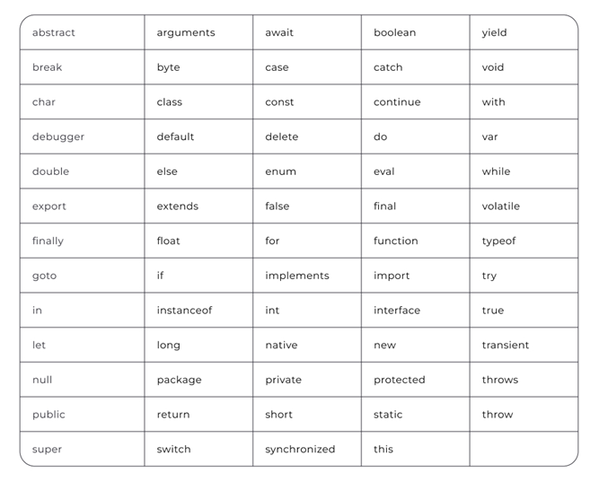

===== Список функцій =====
🔹 1. Функції роботи з числами (Number, Math)
Функція Опис Приклад
Number.parseInt(str) Перетворює рядок у ціле число parseInt("42") // 42
Number.parseFloat(str) Перетворює рядок у десяткове число parseFloat("3.14") // 3.14
Number.isInteger(x) Перевіряє, чи є число цілим Number.isInteger(5) // true
Number.isNaN(x) Перевіряє, чи є значення NaN Number.isNaN("hello") // false
Math.abs(x) Повертає абсолютне значення числа Math.abs(-5) // 5
Math.round(x) Округлення до найближчого цілого Math.round(4.6) // 5
Math.floor(x) Округлення вниз Math.floor(4.9) // 4
Math.ceil(x) Округлення вгору Math.ceil(4.1) // 5
Math.max(a, b, c...) Максимальне число Math.max(10, 5, 8) // 10
Math.min(a, b, c...) Мінімальне число Math.min(10, 5, 8) // 5
Math.random() Випадкове число 0-1 Math.random() // 0.4532...
Math.pow(x, y) Піднесення до степеня Math.pow(2, 3) // 8
Math.sqrt(x) Квадратний корінь Math.sqrt(16) // 4

---

🔹 2. Функції роботи з рядками (String)
Функція Опис Приклад
str.length Довжина рядка "hello".length // 5
str.toUpperCase() У верхній регістр "hello".toUpperCase() // "HELLO"
str.toLowerCase() У нижній регістр "HELLO".toLowerCase() // "hello"
str.includes(substr) Чи є підрядок "Hello".includes("ll") // true
str.startsWith(substr) Починається з "Hello".startsWith("He") // true
str.endsWith(substr) Закінчується на "Hello".endsWith("lo") // true
str.trim() Видаляє пробіли з початку та кінця " hello ".trim() // "hello"
str.slice(start, end) Вирізає частину рядка "hello".slice(1, 4) // "ell"
str.replace(old, new) Замінює частину рядка "apple".replace("p", "b") // "abble"
str.split(delimiter) Розбиває рядок в масив "a,b,c".split(",") // ["a", "b", "c"]

---

🔹 3. Функції роботи з масивами (Array)
Функція Опис Приклад
arr.length Довжина масиву [1, 2, 3].length // 3
arr.push(x) Додає елемент у кінець масиву arr.push(4) // [1,2,3,4]
arr.pop() Видаляє останній елемент arr.pop() // [1,2,3]
arr.shift() Видаляє перший елемент arr.shift() // [2,3]
arr.unshift(x) Додає елемент на початок arr.unshift(0) // [0,1,2,3]
arr.includes(x) Перевіряє, чи є елемент у масиві [1,2,3].includes(2) // true
arr.indexOf(x) Повертає індекс елемента [10, 20, 30].indexOf(20) // 1
arr.reverse() Перевертає масив [1,2,3].reverse() // [3,2,1]
arr.sort() Додає елемент у кінець масиву ["c", "a", "b"].sort() // ["a", "b", "c"]
arr.map(fn) Змінює кожен елемент [1,2,3].map(x => x\*2) // [2,4,6]
arr.filter(fn) Фільтрує масив [1,2,3,4].filter(x => x > 2) // [3,4]

---

🔹 4. Функції роботи з об'єктами (Object)
Функція Опис Приклад
Object.keys(obj) Ключі об'єкта Object.keys({a:1, b:2}) // ["a", "b"]
Object.values(obj) Значення Object.values({a:1, b:2}) // [1,2]
Object.entries(obj) Повертає масив пар Object.entries({a:1, b:2}) // [["a",1], ["b",2]]

---

🔹 5. Робота з JSON
Функція Опис Приклад
JSON.stringify(obj) Перетворює в JSON JSON.stringify({a:1}) // '{"a":1}'
JSON.parse(str) Перетворює JSON в об'єкт JSON.parse('{"a":1}') // {a:1}

---

🔹 6. Робота з датою (Date)
Функція Опис Приклад
new Date() Створює дату new Date()
date.getFullYear() Рік new Date().getFullYear() // 2024
date.getMonth() Місяць (0-11) new Date().getMonth() // 0 (січень)

---

🔹 7. Таймери (setTimeout, setInterval)
Функція Опис Приклад
setTimeout(fn, ms) Виконує код через ms мс setTimeout(() => console.log("Hi!"), 1000)
setInterval(fn, ms) Виконує код кожні ms мс setInterval(() => console.log("Tick"), 2000)

---

🔹 8. Робота з DOM
Функція Опис Приклад
document.getElementById(id) Отримує елемент за ID document.getElementById("myDiv")
document.querySelector(sel) Отримує перший елемент document.querySelector(".box")

===== Список операторів =====
🔹 1. Арифметичні оператори
(Використовуються для виконання математичних операцій)
Оператор Опис Приклад Результат

- Додавання 5 + 3 8

* Віднімання 10 - 7 3

- Множення 4 \* 2 8
  / Ділення 10 / 2 5
  % Остача від ділення 10 % 3 1
  ** Піднесення до степеня 2 ** 3 8

---

🔹 2. Оператори порівняння
(Використовуються для порівняння значень)
Оператор Опис Приклад Результат
== Рівність (без перевірки типу) 5 == "5" true
=== Строга рівність (з перевіркою типу) 5 === "5" false
!= Нерівність (без перевірки типу) 10 != "10" false
!== Строга нерівність (з перевіркою типу) 10 !== "10" true

>     Більше	7 > 5	true
>
> < Менше 4 < 8 true
> = Більше або рівне 6 >= 6 true
> <= Менше або рівне 3 <= 2 false

---

🔹 3. Логічні оператори
(Використовуються для логічних операцій true / false)
Оператор Опис Приклад Результат
&& Логічне "І" (AND) true && false false
|| Логічне "АБО" (OR) false || true true
! Логічне "НЕ" (NOT) !true false
📌 Правила логічного "І" (&&)
• Якщо обидва значення true, результат буде true
• Якщо хоч одне false, результат буде false
📌 Правила логічного "АБО" (||)
• Якщо хоч одне значення true, результат буде true
• Якщо обидва false, результат буде false

---

🔹 4. Оператори присвоєння
(Використовуються для збереження значень у змінні)
Оператор Опис Приклад Еквівалент
= Присвоєння let x = 10 x = 10
+= Додавання та присвоєння x += 5 x = x + 5
-= Віднімання та присвоєння x -= 3 x = x - 3
_= Множення та присвоєння x _= 2 x = x \* 2
/= Ділення та присвоєння x /= 2 x = x / 2
%= Остача від ділення та присвоєння x %= 3 x = x % 3
**= Піднесення до степеня та присвоєння x **= 2 x = x \*\* 2

---

🔹 5. Оператори інкременту та декременту
(Збільшують або зменшують значення змінної на 1)
Оператор Опис Приклад Результат
++ Інкремент (збільшення на 1) let x = 5; x++ x = 6
-- Декремент (зменшення на 1) let y = 8; y-- y = 7
📌 Префіксний та постфіксний інкремент:
• ++x (префіксний) – спочатку збільшує, потім повертає
• x++ (постфіксний) – спочатку повертає, потім збільшує

Таблиця зарезервованих ключових слів:

